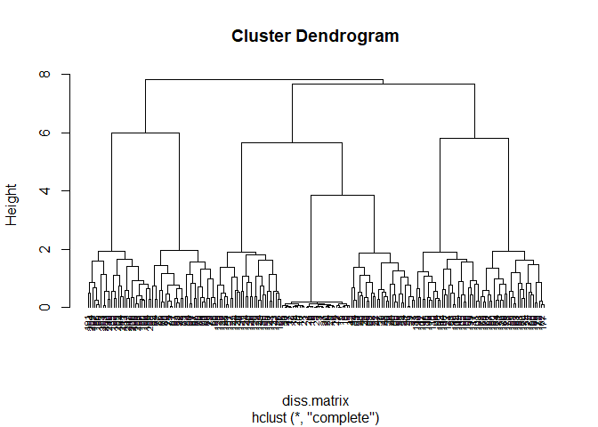

Demonstration of Unsupervised Methods
================
JAS

# Demonstration of Unsupervised Methods

We will be using two different datasets to demonstrate different
unsupervised machine learning methods.

- Breast Cancer Imaging data
  - Data Citation: This breast cancer database was obtained from the
    University of Wisconsin Hospitals, Madison from Dr.William H.
    Wolberg.
- Simulated data that we will use to represent clinical phenotypic data
  on COPD extracted from an EHR system.
  - Data Citation: Ultsch, A.: Clustering with SOM: U\*C, In Proc.
    Workshop on Self-Organizing Maps, Paris, France, (2005) , pp. 75-82

------------------------------------------------------------------------

### Load Packages Needed for Both Demonstrations

Ensure that all packages are installed. Note that the package `ggbiplot`
is not available in R. We are downloading it from the developer’s github
repository.You do not need to replicate the use of `ggbiplot`.

``` r
#First need to load package devtools and Rtools if you want to load packages from github
# library(devtools)

# install_github("vqv/ggbiplot")
library(ggbiplot)
```

    ## Loading required package: ggplot2

    ## Warning: package 'ggplot2' was built under R version 4.2.2

    ## Loading required package: plyr

    ## Warning: package 'plyr' was built under R version 4.2.2

    ## Loading required package: scales

    ## Loading required package: grid

``` r
library(stats)
library(factoextra)
```

    ## Warning: package 'factoextra' was built under R version 4.2.2

    ## Welcome! Want to learn more? See two factoextra-related books at https://goo.gl/ve3WBa

``` r
library(cluster)
```

    ## Warning: package 'cluster' was built under R version 4.2.2

``` r
library(tidyverse)
```

    ## ── Attaching packages
    ## ───────────────────────────────────────
    ## tidyverse 1.3.2 ──

    ## ✔ tibble  3.1.8      ✔ dplyr   1.0.10
    ## ✔ tidyr   1.2.1      ✔ stringr 1.5.0 
    ## ✔ readr   2.1.3      ✔ forcats 0.5.2 
    ## ✔ purrr   0.3.5

    ## Warning: package 'readr' was built under R version 4.2.2

    ## Warning: package 'purrr' was built under R version 4.2.2

    ## Warning: package 'dplyr' was built under R version 4.2.2

    ## Warning: package 'stringr' was built under R version 4.2.2

    ## ── Conflicts ────────────────────────────────────────── tidyverse_conflicts() ──
    ## ✖ dplyr::arrange()    masks plyr::arrange()
    ## ✖ readr::col_factor() masks scales::col_factor()
    ## ✖ purrr::compact()    masks plyr::compact()
    ## ✖ dplyr::count()      masks plyr::count()
    ## ✖ purrr::discard()    masks scales::discard()
    ## ✖ dplyr::failwith()   masks plyr::failwith()
    ## ✖ dplyr::filter()     masks stats::filter()
    ## ✖ dplyr::id()         masks plyr::id()
    ## ✖ dplyr::lag()        masks stats::lag()
    ## ✖ dplyr::mutate()     masks plyr::mutate()
    ## ✖ dplyr::rename()     masks plyr::rename()
    ## ✖ dplyr::summarise()  masks plyr::summarise()
    ## ✖ dplyr::summarize()  masks plyr::summarize()

## Demonstration of Principal Components Analysis

First, we will utilize breast cancer imaging data. In this
demonstration, rather than trying to predict malignancy, we are
interested in determining if we can uncover the underlying constructs of
the image that are explained by the nine features. In other words, can
we **reduce the number of features** from nine down to some smaller
number but still capture the same information. Is there shared
information across those features? To accomplish this, we will apply
***principal components analysis (PCA)*** to the feature data within the
breast cancer dataset.

------------------------------------------------------------------------

### Step 1: Load and Prepare Dataset

Remember to replace the file path with the location where the breast
cancer data are stored.

``` r
bc.data<-read.csv("./Data/breast_cancer_wisconsin.data.txt", header = FALSE)

# There are no informative variable names, so we need to add variable names manually:
var.names<-c("id", "clump_thickness", "uniformity_csize", "uniformity_cshape", "marg_adhesion", "single_ecell_size", "bare_nuclei", "b_chromatin", "normal_nucleoli", "mitoses", "outcome")
colnames(bc.data)<-var.names
str(bc.data)
```

    ## 'data.frame':    699 obs. of  11 variables:
    ##  $ id               : int  1000025 1002945 1015425 1016277 1017023 1017122 1018099 1018561 1033078 1033078 ...
    ##  $ clump_thickness  : int  5 5 3 6 4 8 1 2 2 4 ...
    ##  $ uniformity_csize : int  1 4 1 8 1 10 1 1 1 2 ...
    ##  $ uniformity_cshape: int  1 4 1 8 1 10 1 2 1 1 ...
    ##  $ marg_adhesion    : int  1 5 1 1 3 8 1 1 1 1 ...
    ##  $ single_ecell_size: int  2 7 2 3 2 7 2 2 2 2 ...
    ##  $ bare_nuclei      : chr  "1" "10" "2" "4" ...
    ##  $ b_chromatin      : int  3 3 3 3 3 9 3 3 1 2 ...
    ##  $ normal_nucleoli  : int  1 2 1 7 1 7 1 1 1 1 ...
    ##  $ mitoses          : int  1 1 1 1 1 1 1 1 5 1 ...
    ##  $ outcome          : int  2 2 2 2 2 4 2 2 2 2 ...

``` r
# Clean data of '?' as in previous demonstration
bc.data[bc.data=="?"]<-NA
bc.data$bare_nuclei<-as.numeric(bc.data$bare_nuclei)

# Restrict to malignant cases because we are only interested in looking similarities in the cases. Is there some underlying information 
# that can help us understand the breast imaging of cases:
bc.data<-bc.data[(which(bc.data$outcome==4)),]

# Strip off the outcome and id variable becasue we only want a dataset with features in it.
bc.data.features<-(bc.data[,2:10])
```

### Step 2: Determine if scaling is necessary

Generally, we want all our data to be on the same scale.

``` r
# Obtain and compare means and standard deviations across features. na.rm removes the missings
colMeans(bc.data.features, na.rm = TRUE)
```

    ##   clump_thickness  uniformity_csize uniformity_cshape     marg_adhesion 
    ##          7.195021          6.572614          6.560166          5.547718 
    ## single_ecell_size       bare_nuclei       b_chromatin   normal_nucleoli 
    ##          5.298755          7.627615          5.979253          5.863071 
    ##           mitoses 
    ##          2.589212

``` r
apply(bc.data.features, 2, sd, na.rm = TRUE)
```

    ##   clump_thickness  uniformity_csize uniformity_cshape     marg_adhesion 
    ##          2.428849          2.719512          2.562045          3.210465 
    ## single_ecell_size       bare_nuclei       b_chromatin   normal_nucleoli 
    ##          2.451606          3.116679          2.273852          3.350672 
    ##           mitoses 
    ##          2.557939

``` r
# If we see some difference in means and standard deviations, we need to center and scale. 
```

### Step 3: Conduct the Principal Components Analysis

The function `prcomp()` will center and scale the variables and then
identify the principal components

``` r
bc.pca<-prcomp( ~., data = bc.data.features, center = TRUE, scale = TRUE, na.action = na.omit) # the "~." means include all features in the dataset

# Can compare sds used to scale with the sds above to ensure they are close.
bc.pca$scale
```

    ##   clump_thickness  uniformity_csize uniformity_cshape     marg_adhesion 
    ##          2.437907          2.724244          2.569104          3.196631 
    ## single_ecell_size       bare_nuclei       b_chromatin   normal_nucleoli 
    ##          2.443087          3.116679          2.282422          3.348876 
    ##           mitoses 
    ##          2.564495

``` r
# Generates scree plot
fviz_eig(bc.pca)
```

<!-- -->

``` r
# view results of pca. Note the first three components are needed to explain at least 75% of the variance
summary(bc.pca)
```

    ## Importance of components:
    ##                           PC1    PC2    PC3    PC4    PC5     PC6     PC7
    ## Standard deviation     1.6881 1.1405 1.0114 0.9710 0.8955 0.82523 0.79132
    ## Proportion of Variance 0.3166 0.1445 0.1137 0.1048 0.0891 0.07567 0.06958
    ## Cumulative Proportion  0.3166 0.4611 0.5748 0.6795 0.7687 0.84432 0.91389
    ##                           PC8    PC9
    ## Standard deviation     0.7181 0.5092
    ## Proportion of Variance 0.0573 0.0288
    ## Cumulative Proportion  0.9712 1.0000

``` r
# The result shows that there isn't much shared information across features because only PC1 explains 32% of the variance, PC2 and PC3 only explain 10-15%.

# Identify how features loaded on the different components
bc.pca$rotation
```

    ##                           PC1         PC2         PC3         PC4         PC5
    ## clump_thickness   -0.04423311  0.47453175 -0.72050432  0.03375094 -0.33747692
    ## uniformity_csize  -0.49200997  0.09144594 -0.10713144 -0.23385625  0.25878373
    ## uniformity_cshape -0.46669310  0.06386848 -0.19774730 -0.24213467  0.20325032
    ## marg_adhesion     -0.31654337 -0.44402770  0.10728697  0.25657447 -0.08457519
    ## single_ecell_size -0.38065450  0.18190583  0.12106578  0.20864693  0.44399919
    ## bare_nuclei       -0.03443192 -0.57557062 -0.49808880  0.35266296 -0.04647075
    ## b_chromatin       -0.34513808 -0.32908090 -0.09767689 -0.30475120 -0.26382710
    ## normal_nucleoli   -0.31497084  0.09772667  0.36209294 -0.12934244 -0.69424240
    ## mitoses           -0.27121420  0.28809974  0.12401793  0.73634571 -0.14072880
    ##                           PC6         PC7         PC8          PC9
    ## clump_thickness    0.19363953  0.06219100  0.31186804  0.009006567
    ## uniformity_csize   0.05030229 -0.22115522 -0.11677498 -0.742531194
    ## uniformity_cshape -0.13515456 -0.40047847 -0.22875166  0.638825011
    ## marg_adhesion      0.56327695 -0.28239595  0.46360581  0.078657744
    ## single_ecell_size -0.28036154  0.49840771  0.47849939  0.103499670
    ## bare_nuclei       -0.52478456 -0.04208568 -0.03054114 -0.121683838
    ## b_chromatin        0.24258816  0.66277346 -0.31133678  0.074285922
    ## normal_nucleoli   -0.44416638 -0.13065490  0.20939361 -0.056828116
    ## mitoses            0.11954714  0.02390310 -0.50117220 -0.003860273

``` r
# From the results, we can see that "bare_nuclei" is loading positively on PC2 and PC3.

ggbiplot(bc.pca)
```

<!-- -->

``` r
ggbiplot(bc.pca, choices = c(2, 3))
```

<!-- -->

``` r
# We can see that "bare_nuclei" is increasing in the dimension of PC2 and PC3, which suggests that it is loading strongly on those 2 principal components.
```

Based on the results, maybe PCA is not as good for analysis because
there is not much shared variance across the 9 features.

------------------------------------------------------------------------

## Demonstration of Clustering Analysis

In this demonstration, we will attempt to uncover phenotypic subtypes
within clinical data of Chronic Obstructive Pulmonary Disease (COPD).
COPD is defined as airflow limitation that is not fully reversible. This
is a very broad definition, and it suspected that there are a number of
distinct phenotypes within the broader term of COPD. Identifying these
subtypes can allow researchers to conduct more targeted investigations
of COPD, uncovering mechanisms and risk factors for the different
subtypes. This demonstration is loosely based on the work performed by
Cho et al. Respiratory Research 2010; 11:30. The data are not the same.
Please note that for practical reasons, we are using a small dataset
with only 3 variables and 212 patient records. But, this same procedure
could be repeated with a larger number of variables and/or records.

For this demonstration, the three variables in our dataset are: 1.
post-bronchodilator FEV1 percent predicted 2. percent bronchodilator
responsiveness 3. airway wall thickness

Goal: With these 3 features, can we cluster our data to what might
represent clinical phenotypes? \*\*\*

### Step 1: Load data and prepare for analysis

``` r
copd.data<-read.delim("./Data/Hepta.lrn", header = FALSE)

copd.data<-copd.data[,2:4] # we only want column 2:4 because column 1 is just row number (meaningless)

# Assign column names
var.names<-c("pb_FEV1_pctpred", "pct_br_resp", "awt")
colnames(copd.data)<-var.names

# Omit missing data
copd.data.nomiss<-na.omit(copd.data)

# Check means and SDs to determine if scaling is necessary
colMeans(copd.data.nomiss, na.rm=TRUE)
```

    ## pb_FEV1_pctpred     pct_br_resp             awt 
    ##      0.01541768      0.03418329     -0.03562636

``` r
apply(copd.data.nomiss, 2, sd, na.rm=TRUE)
```

    ## pb_FEV1_pctpred     pct_br_resp             awt 
    ##        1.647716        1.670505        1.628822

``` r
# The means are small and very close to zero. Standard deviations are very similar. So scaling might not be necessary.
```

### Step 2: Conduct a clustering analysis using k-means clustering

We can use the `kmeans` function in order to identify clusters within
the data, based on the three variables. With *kmeans clustering*, we
must first set the value of *k* (# of clusters).

``` r
set.seed(100)
clusters<-kmeans(copd.data.nomiss, 5, nstart = 25)
str(clusters)
```

    ## List of 9
    ##  $ cluster     : Named int [1:212] 2 2 2 2 2 2 2 2 2 2 ...
    ##   ..- attr(*, "names")= chr [1:212] "1" "2" "3" "4" ...
    ##  $ centers     : num [1:5, 1:3] 2.9995 -0.9802 0.0227 0.14 -0.0473 ...
    ##   ..- attr(*, "dimnames")=List of 2
    ##   .. ..$ : chr [1:5] "1" "2" "3" "4" ...
    ##   .. ..$ : chr [1:3] "pb_FEV1_pctpred" "pct_br_resp" "awt"
    ##  $ totss       : num 1721
    ##  $ withinss    : num [1:5] 16.8 380.5 19 15.9 16.4
    ##  $ tot.withinss: num 449
    ##  $ betweenss   : num 1273
    ##  $ size        : int [1:5] 30 92 30 30 30
    ##  $ iter        : int 3
    ##  $ ifault      : int 0
    ##  - attr(*, "class")= chr "kmeans"

``` r
clusters
```

    ## K-means clustering with 5 clusters of sizes 30, 92, 30, 30, 30
    ## 
    ## Cluster means:
    ##   pb_FEV1_pctpred  pct_br_resp        awt
    ## 1      2.99953830 -0.001130867 -0.1400596
    ## 2     -0.98022513  0.027156902  0.9679342
    ## 3      0.02271230 -2.968135967 -0.1117746
    ## 4      0.13998693  3.081746967  0.0745050
    ## 5     -0.04726217  0.045800633 -3.0427619
    ## 
    ## Clustering vector:
    ##   1   2   3   4   5   6   7   8   9  10  11  12  13  14  15  16  17  18  19  20 
    ##   2   2   2   2   2   2   2   2   2   2   2   2   2   2   2   2   2   2   2   2 
    ##  21  22  23  24  25  26  27  28  29  30  31  32  33  34  35  36  37  38  39  40 
    ##   2   2   2   2   2   2   2   2   2   2   2   2   1   1   1   1   1   1   1   1 
    ##  41  42  43  44  45  46  47  48  49  50  51  52  53  54  55  56  57  58  59  60 
    ##   1   1   1   1   1   1   1   1   1   1   1   1   1   1   1   1   1   1   1   1 
    ##  61  62  63  64  65  66  67  68  69  70  71  72  73  74  75  76  77  78  79  80 
    ##   1   1   2   2   2   2   2   2   2   2   2   2   2   2   2   2   2   2   2   2 
    ##  81  82  83  84  85  86  87  88  89  90  91  92  93  94  95  96  97  98  99 100 
    ##   2   2   2   2   2   2   2   2   2   2   2   2   4   4   4   4   4   4   4   4 
    ## 101 102 103 104 105 106 107 108 109 110 111 112 113 114 115 116 117 118 119 120 
    ##   4   4   4   4   4   4   4   4   4   4   4   4   4   4   4   4   4   4   4   4 
    ## 121 122 123 124 125 126 127 128 129 130 131 132 133 134 135 136 137 138 139 140 
    ##   4   4   3   3   3   3   3   3   3   3   3   3   3   3   3   3   3   3   3   3 
    ## 141 142 143 144 145 146 147 148 149 150 151 152 153 154 155 156 157 158 159 160 
    ##   3   3   3   3   3   3   3   3   3   3   3   3   2   2   2   2   2   2   2   2 
    ## 161 162 163 164 165 166 167 168 169 170 171 172 173 174 175 176 177 178 179 180 
    ##   2   2   2   2   2   2   2   2   2   2   2   2   2   2   2   2   2   2   2   2 
    ## 181 182 183 184 185 186 187 188 189 190 191 192 193 194 195 196 197 198 199 200 
    ##   2   2   5   5   5   5   5   5   5   5   5   5   5   5   5   5   5   5   5   5 
    ## 201 202 203 204 205 206 207 208 209 210 211 212 
    ##   5   5   5   5   5   5   5   5   5   5   5   5 
    ## 
    ## Within cluster sum of squares by cluster:
    ## [1]  16.76277 380.54311  18.96642  15.94301  16.41814
    ##  (between_SS / total_SS =  73.9 %)
    ## 
    ## Available components:
    ## 
    ## [1] "cluster"      "centers"      "totss"        "withinss"     "tot.withinss"
    ## [6] "betweenss"    "size"         "iter"         "ifault"

``` r
fviz_cluster(clusters, data = copd.data.nomiss)
```

<!-- -->

``` r
#Show the mean value of features within each cluster
clusters$centers
```

    ##   pb_FEV1_pctpred  pct_br_resp        awt
    ## 1      2.99953830 -0.001130867 -0.1400596
    ## 2     -0.98022513  0.027156902  0.9679342
    ## 3      0.02271230 -2.968135967 -0.1117746
    ## 4      0.13998693  3.081746967  0.0745050
    ## 5     -0.04726217  0.045800633 -3.0427619

Remember, we set the \# of clusters to be 5, so the algorithm forced all
data into 5 clusters. From the plot, we can see that the yellow cluster
is somewhat big and seems like it is made up of 3 different clusters.
So, we should conduct a ***gap_statistic analysis*** to determine
optimal number of clusters.

``` r
set.seed(100)
gap_stat<-clusGap(copd.data.nomiss, FUN = kmeans, nstart = 25, K.max = 9, B = 50) # FUN = function; B = # of bootstraps
print(gap_stat, method = "firstmax")
```

    ## Clustering Gap statistic ["clusGap"] from call:
    ## clusGap(x = copd.data.nomiss, FUNcluster = kmeans, K.max = 9, B = 50, nstart = 25)
    ## B=50 simulated reference sets, k = 1..9; spaceH0="scaledPCA"
    ##  --> Number of clusters (method 'firstmax'): 7
    ##           logW   E.logW       gap     SE.sim
    ##  [1,] 5.282842 5.476391 0.1935487 0.01971434
    ##  [2,] 5.082621 5.292323 0.2097018 0.01967541
    ##  [3,] 4.914357 5.155441 0.2410837 0.02216689
    ##  [4,] 4.717145 5.037086 0.3199415 0.02172368
    ##  [5,] 4.462394 4.940356 0.4779614 0.02013570
    ##  [6,] 4.162681 4.854163 0.6914819 0.01925715
    ##  [7,] 3.825676 4.784056 0.9583801 0.01849430
    ##  [8,] 3.783336 4.724362 0.9410261 0.01803174
    ##  [9,] 3.748213 4.674145 0.9259322 0.01755657

``` r
# The result provides us the optimal number of clusters, which is 7 in this demonstration.
# We can look at the result table. At 7 clusters, the value of gap is the highest (0.9583801)
```

Now we can go back to use our `kmeans` function and set seven clusters:

``` r
clusters.7<-kmeans(copd.data.nomiss, 7, nstart = 25)

str(clusters.7)
```

    ## List of 9
    ##  $ cluster     : Named int [1:212] 7 7 7 7 7 7 7 7 7 7 ...
    ##   ..- attr(*, "names")= chr [1:212] "1" "2" "3" "4" ...
    ##  $ centers     : num [1:7, 1:3] 0.13999 -0.00631 0.02271 -0.04726 2.99954 ...
    ##   ..- attr(*, "dimnames")=List of 2
    ##   .. ..$ : chr [1:7] "1" "2" "3" "4" ...
    ##   .. ..$ : chr [1:3] "pb_FEV1_pctpred" "pct_br_resp" "awt"
    ##  $ totss       : num 1721
    ##  $ withinss    : num [1:7] 15.9 19.1 19 16.4 16.8 ...
    ##  $ tot.withinss: num 106
    ##  $ betweenss   : num 1615
    ##  $ size        : int [1:7] 30 30 30 30 30 30 32
    ##  $ iter        : int 2
    ##  $ ifault      : int 0
    ##  - attr(*, "class")= chr "kmeans"

``` r
clusters.7
```

    ## K-means clustering with 7 clusters of sizes 30, 30, 30, 30, 30, 30, 32
    ## 
    ## Cluster means:
    ##   pb_FEV1_pctpred  pct_br_resp          awt
    ## 1     0.139986933  3.081746967  0.074505000
    ## 2    -0.006311900  0.091942133  2.872362000
    ## 3     0.022712300 -2.968135967 -0.111774567
    ## 4    -0.047262167  0.045800633 -3.042761900
    ## 5     2.999538300 -0.001130867 -0.140059600
    ## 6    -2.995188400 -0.013736333  0.088239600
    ## 7    -0.004240719  0.004758156  0.007246719
    ## 
    ## Clustering vector:
    ##   1   2   3   4   5   6   7   8   9  10  11  12  13  14  15  16  17  18  19  20 
    ##   7   7   7   7   7   7   7   7   7   7   7   7   7   7   7   7   7   7   7   7 
    ##  21  22  23  24  25  26  27  28  29  30  31  32  33  34  35  36  37  38  39  40 
    ##   7   7   7   7   7   7   7   7   7   7   7   7   5   5   5   5   5   5   5   5 
    ##  41  42  43  44  45  46  47  48  49  50  51  52  53  54  55  56  57  58  59  60 
    ##   5   5   5   5   5   5   5   5   5   5   5   5   5   5   5   5   5   5   5   5 
    ##  61  62  63  64  65  66  67  68  69  70  71  72  73  74  75  76  77  78  79  80 
    ##   5   5   6   6   6   6   6   6   6   6   6   6   6   6   6   6   6   6   6   6 
    ##  81  82  83  84  85  86  87  88  89  90  91  92  93  94  95  96  97  98  99 100 
    ##   6   6   6   6   6   6   6   6   6   6   6   6   1   1   1   1   1   1   1   1 
    ## 101 102 103 104 105 106 107 108 109 110 111 112 113 114 115 116 117 118 119 120 
    ##   1   1   1   1   1   1   1   1   1   1   1   1   1   1   1   1   1   1   1   1 
    ## 121 122 123 124 125 126 127 128 129 130 131 132 133 134 135 136 137 138 139 140 
    ##   1   1   3   3   3   3   3   3   3   3   3   3   3   3   3   3   3   3   3   3 
    ## 141 142 143 144 145 146 147 148 149 150 151 152 153 154 155 156 157 158 159 160 
    ##   3   3   3   3   3   3   3   3   3   3   3   3   2   2   2   2   2   2   2   2 
    ## 161 162 163 164 165 166 167 168 169 170 171 172 173 174 175 176 177 178 179 180 
    ##   2   2   2   2   2   2   2   2   2   2   2   2   2   2   2   2   2   2   2   2 
    ## 181 182 183 184 185 186 187 188 189 190 191 192 193 194 195 196 197 198 199 200 
    ##   2   2   4   4   4   4   4   4   4   4   4   4   4   4   4   4   4   4   4   4 
    ## 201 202 203 204 205 206 207 208 209 210 211 212 
    ##   4   4   4   4   4   4   4   4   4   4   4   4 
    ## 
    ## Within cluster sum of squares by cluster:
    ## [1] 15.9430101 19.1101049 18.9664192 16.4181437 16.7627682 18.7597739  0.1874266
    ##  (between_SS / total_SS =  93.8 %)
    ## 
    ## Available components:
    ## 
    ## [1] "cluster"      "centers"      "totss"        "withinss"     "tot.withinss"
    ## [6] "betweenss"    "size"         "iter"         "ifault"

``` r
fviz_cluster(clusters.7, data = copd.data.nomiss)
```

<!-- -->

``` r
# Now the clusters look more reasonable.
```

### Step 3: Conduct a hierarchical clustering analysis

Note there are different methods you can use to create your
dissimilarity matrix. We are using *complete linkage* in this
demonstration, which tends to produce more compact clusters. In this
demonstration, we are using the top-down method `hclust`, which will
grow from the top to the bottom. That means everyone will start from
their own cluster and then sort of group together.

``` r
# Create Dissimilarity matrix
diss.matrix <- dist(copd.data.nomiss, method = "euclidean")

# Hierarchical clustering using Complete Linkage
clusters.h<- hclust(diss.matrix, method = "complete" )

# Plot the obtained dendrogram
plot(clusters.h, cex = 0.6, hang = -1)
```

<!-- -->

Now that we have the dendrogram, but how do we determine where in the
height do we draw to obtain the optimal number of clusters? Use the
***gap_statistic analysis*** to find out!

``` r
#create function to use within clusGap
hclusCut <- function(x, k) list(cluster = cutree(hclust(dist(x, method="euclidian"), method="average"), k=k))

gap_stat <- clusGap(copd.data.nomiss, FUN = hclusCut, K.max = 10, B = 50)
fviz_gap_stat(gap_stat)
```

<!-- -->

``` r
# If I don't want to create a function, I can just state FUN = hcut.
gap_stat <- clusGap(copd.data.nomiss, FUN = hcut, K.max = 10, B = 50)
fviz_gap_stat(gap_stat)
```

<!-- -->

After we obtain the optimal number of clusters, we can use number of
clusters from gap statistic to obtain cluster assignment for each
observation.

``` r
clusters.h.7<-cutree(clusters.h, k=7)
table(clusters.h.7)
```

    ## clusters.h.7
    ##  1  2  3  4  5  6  7 
    ## 32 30 30 30 30 30 30

Alternatives for hierarchical clustering:

``` r
clusters.hcut<-hcut(copd.data.nomiss, k = 5, hc_func = "hclust", hc_method = "single", hc_metric = "euclidian")

clusters.hcut$size
```

    ## [1] 92 30 30 30 30

``` r
fviz_dend(clusters.hcut, rect=TRUE)
```

    ## Warning: The `<scale>` argument of `guides()` cannot be `FALSE`. Use "none" instead as
    ## of ggplot2 3.3.4.
    ## ℹ The deprecated feature was likely used in the factoextra package.
    ##   Please report the issue at <]8;;https://github.com/kassambara/factoextra/issueshttps://github.com/kassambara/factoextra/issues]8;;>.

<!-- -->

``` r
fviz_cluster(clusters.hcut)
```

<!-- -->

``` r
gap_stat <- clusGap(copd.data.nomiss, FUN = hcut, hc_method="single", K.max = 10, B = 5)
fviz_gap_stat(gap_stat)
```

<!-- -->

``` r
input.feature.vals<-cbind(copd.data.nomiss,cluster=clusters.hcut$cluster)

input.feature.vals %>%
  group_by(cluster) %>%
  summarise_all(mean)
```

    ## # A tibble: 5 × 4
    ##   cluster pb_FEV1_pctpred pct_br_resp      awt
    ##     <int>           <dbl>       <dbl>    <dbl>
    ## 1       1         0.0516      0.0387  -0.00963
    ## 2       2         3.00       -0.00113 -0.140  
    ## 3       3        -3.00       -0.0137   0.0882 
    ## 4       4        -0.00631     0.0919   2.87   
    ## 5       5        -0.0473      0.0458  -3.04

``` r
#GENERAL SYNTAX
#input.feature.vals<-cbind(orig.data,cluster=cluster.object$cluster)

#input.feature.vals %>%
 # group_by(`cluster.object$cluster`) %>%
  #summarise_all(mean)
```
