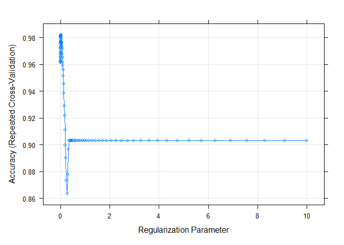

Demonstration of Caret for Machine Learning
================
Lectured by JAS

``` r
knitr::opts_chunk$set(message = FALSE, warning = FALSE)
```

## Overview of the Caret Package

The caret package (Classification And REgression Training) contains a
number of functions to streamline the process for creating analytic
pipelines for prediction. It calls to other libraries to run algorithms,
but provides a seamless and uniform interface for working with different
algorithms.

Primary functionalities of caret include:

- pre-processing
- data splitting
- feature selection
- model tuning using resampling
- variable importance estimation

------------------------------------------------------------------------

Helpful resources using caret:

Max Kuhn’s explainer of the caret package
<https://topepo.github.io/caret/model-training-and-tuning.html>

Kuhn M. Building predictive models in R using the caret package. Journal
of Statistical Software 2008;28(5) doi: 10.18637/jss.v028.i05

Webinar, given by Max Kuhn, available on YouTube (\~1 hour):
<https://www.youtube.com/watch?v=7Jbb2ItbTC4>

------------------------------------------------------------------------

Data Source: UCI Machine Learning Repository, HCV data Dataset

The dataset contains laboratory values of blood donors (control) and
Hepatitis C patients with varying levels of liver damage. Created by
Lichtinghagen, Klawonn and Hoffmann. Lichtinghagen R et al. J Hepatol
2013; 59: 236-42

Attribute Information:

All attributes except Category and Sex are numerical. The laboratory
data are the attributes 5-14. 1) X (Patient ID/No.) 2) Category
(diagnosis) (values: ‘0=Blood Donor’, ‘0s=suspect Blood Donor’,
‘1=Hepatitis’, ‘2=Fibrosis’, ‘3=Cirrhosis’) 3) Age (in years) 4) Sex
(f,m) 5) ALB 6) ALP 7) ALT 8) AST 9) BIL 10) CHE 11) CHOL 12) CREA 13)
GGT 14) PROT

### Some useful functions for pre-processing outside of the train function

``` r
library(tidyverse)
library(caret)
library(stats) #PCA
library(glmnet) # Regularization 

# Read in data on liver function study
set.seed(111)
hcvdat0 <- read.csv("./Data/hcvdat0.csv")


# Make outcome category a factor var
hcvdat0$Category<-as.factor(hcvdat0$Category)

# Collapse factor levels of outcome variable to binary outcome: D+ or D-
hcvdat0$outcome.class<-fct_collapse(hcvdat0$Category, NED=c("0=Blood Donor","0s=suspect Blood Donor"), LiverDisease=c("1=Hepatitis", "2=Fibrosis", "3=Cirrhosis"))

# Drop category and ID variable and remove missing data
hcvdat0$Category<-NULL
hcvdat0$X<-NULL
hcvdat0<-na.omit(hcvdat0)

# Finding correlated predictors to remove variables that are highly correlated
hcvdat.numeric<- hcvdat0 %>% dplyr::select(where(is.numeric)) # Correlation can only be done with numeric variables
correlations<-cor(hcvdat.numeric, use = "complete.obs") # Calculate correlations using `cor` function
high.correlations<-findCorrelation(correlations, cutoff = 0.4) # Find any features that are correlated at 0.4 and above, and store them into this vector called high.correlations

# Remove highly correlated features
new.data.low.corr<-hcvdat.numeric[,-high.correlations]


# Centering and Scaling
set.up.preprocess = preProcess(hcvdat.numeric, method = c("center", "scale"))
# Output pre-processed values to the original dataset
transformed.vals = predict(set.up.preprocess, hcvdat.numeric)

# Creating balanced partitions in the data
# Balanced means same proportion of outcome in both training & testing datasets.
# If we have continuous outcome, then it will split outcome into quantiles and it will ensure it is balanced across quantiles.
train.index = createDataPartition(hcvdat0$outcome.class, p = 0.7, list = FALSE)

hcvdat.train = hcvdat0[train.index,]
hcvdat.test = hcvdat0[-train.index,]


# Construct k-folds in your data (Cross-validation)
train.folds = createFolds(hcvdat0$outcome.class, k = 10, list = FALSE)
# We don't often do this because we usually do cross-validation in the model.
```

### Model Training and Tuning

Using the train function to implement your analytic pipeline. Train
function can be used to implement different algorithms using `method =`
option.

``` r
# See what caret can do!
names(getModelInfo())
```

    ##   [1] "ada"                 "AdaBag"              "AdaBoost.M1"        
    ##   [4] "adaboost"            "amdai"               "ANFIS"              
    ##   [7] "avNNet"              "awnb"                "awtan"              
    ##  [10] "bag"                 "bagEarth"            "bagEarthGCV"        
    ##  [13] "bagFDA"              "bagFDAGCV"           "bam"                
    ##  [16] "bartMachine"         "bayesglm"            "binda"              
    ##  [19] "blackboost"          "blasso"              "blassoAveraged"     
    ##  [22] "bridge"              "brnn"                "BstLm"              
    ##  [25] "bstSm"               "bstTree"             "C5.0"               
    ##  [28] "C5.0Cost"            "C5.0Rules"           "C5.0Tree"           
    ##  [31] "cforest"             "chaid"               "CSimca"             
    ##  [34] "ctree"               "ctree2"              "cubist"             
    ##  [37] "dda"                 "deepboost"           "DENFIS"             
    ##  [40] "dnn"                 "dwdLinear"           "dwdPoly"            
    ##  [43] "dwdRadial"           "earth"               "elm"                
    ##  [46] "enet"                "evtree"              "extraTrees"         
    ##  [49] "fda"                 "FH.GBML"             "FIR.DM"             
    ##  [52] "foba"                "FRBCS.CHI"           "FRBCS.W"            
    ##  [55] "FS.HGD"              "gam"                 "gamboost"           
    ##  [58] "gamLoess"            "gamSpline"           "gaussprLinear"      
    ##  [61] "gaussprPoly"         "gaussprRadial"       "gbm_h2o"            
    ##  [64] "gbm"                 "gcvEarth"            "GFS.FR.MOGUL"       
    ##  [67] "GFS.LT.RS"           "GFS.THRIFT"          "glm.nb"             
    ##  [70] "glm"                 "glmboost"            "glmnet_h2o"         
    ##  [73] "glmnet"              "glmStepAIC"          "gpls"               
    ##  [76] "hda"                 "hdda"                "hdrda"              
    ##  [79] "HYFIS"               "icr"                 "J48"                
    ##  [82] "JRip"                "kernelpls"           "kknn"               
    ##  [85] "knn"                 "krlsPoly"            "krlsRadial"         
    ##  [88] "lars"                "lars2"               "lasso"              
    ##  [91] "lda"                 "lda2"                "leapBackward"       
    ##  [94] "leapForward"         "leapSeq"             "Linda"              
    ##  [97] "lm"                  "lmStepAIC"           "LMT"                
    ## [100] "loclda"              "logicBag"            "LogitBoost"         
    ## [103] "logreg"              "lssvmLinear"         "lssvmPoly"          
    ## [106] "lssvmRadial"         "lvq"                 "M5"                 
    ## [109] "M5Rules"             "manb"                "mda"                
    ## [112] "Mlda"                "mlp"                 "mlpKerasDecay"      
    ## [115] "mlpKerasDecayCost"   "mlpKerasDropout"     "mlpKerasDropoutCost"
    ## [118] "mlpML"               "mlpSGD"              "mlpWeightDecay"     
    ## [121] "mlpWeightDecayML"    "monmlp"              "msaenet"            
    ## [124] "multinom"            "mxnet"               "mxnetAdam"          
    ## [127] "naive_bayes"         "nb"                  "nbDiscrete"         
    ## [130] "nbSearch"            "neuralnet"           "nnet"               
    ## [133] "nnls"                "nodeHarvest"         "null"               
    ## [136] "OneR"                "ordinalNet"          "ordinalRF"          
    ## [139] "ORFlog"              "ORFpls"              "ORFridge"           
    ## [142] "ORFsvm"              "ownn"                "pam"                
    ## [145] "parRF"               "PART"                "partDSA"            
    ## [148] "pcaNNet"             "pcr"                 "pda"                
    ## [151] "pda2"                "penalized"           "PenalizedLDA"       
    ## [154] "plr"                 "pls"                 "plsRglm"            
    ## [157] "polr"                "ppr"                 "pre"                
    ## [160] "PRIM"                "protoclass"          "qda"                
    ## [163] "QdaCov"              "qrf"                 "qrnn"               
    ## [166] "randomGLM"           "ranger"              "rbf"                
    ## [169] "rbfDDA"              "Rborist"             "rda"                
    ## [172] "regLogistic"         "relaxo"              "rf"                 
    ## [175] "rFerns"              "RFlda"               "rfRules"            
    ## [178] "ridge"               "rlda"                "rlm"                
    ## [181] "rmda"                "rocc"                "rotationForest"     
    ## [184] "rotationForestCp"    "rpart"               "rpart1SE"           
    ## [187] "rpart2"              "rpartCost"           "rpartScore"         
    ## [190] "rqlasso"             "rqnc"                "RRF"                
    ## [193] "RRFglobal"           "rrlda"               "RSimca"             
    ## [196] "rvmLinear"           "rvmPoly"             "rvmRadial"          
    ## [199] "SBC"                 "sda"                 "sdwd"               
    ## [202] "simpls"              "SLAVE"               "slda"               
    ## [205] "smda"                "snn"                 "sparseLDA"          
    ## [208] "spikeslab"           "spls"                "stepLDA"            
    ## [211] "stepQDA"             "superpc"             "svmBoundrangeString"
    ## [214] "svmExpoString"       "svmLinear"           "svmLinear2"         
    ## [217] "svmLinear3"          "svmLinearWeights"    "svmLinearWeights2"  
    ## [220] "svmPoly"             "svmRadial"           "svmRadialCost"      
    ## [223] "svmRadialSigma"      "svmRadialWeights"    "svmSpectrumString"  
    ## [226] "tan"                 "tanSearch"           "treebag"            
    ## [229] "vbmpRadial"          "vglmAdjCat"          "vglmContRatio"      
    ## [232] "vglmCumulative"      "widekernelpls"       "WM"                 
    ## [235] "wsrf"                "xgbDART"             "xgbLinear"          
    ## [238] "xgbTree"             "xyf"

``` r
modelLookup("rpart")
```

    ##   model parameter                label forReg forClass probModel
    ## 1 rpart        cp Complexity Parameter   TRUE     TRUE      TRUE

``` r
modelLookup("adaboost")
```

    ##      model parameter  label forReg forClass probModel
    ## 1 adaboost     nIter #Trees  FALSE     TRUE      TRUE
    ## 2 adaboost    method Method  FALSE     TRUE      TRUE

``` r
# Train Function: used for tuning of hyperparameters and choosing "optimal" model

# Use trainControl Function to set validation method and options (default is bootstrap)

# Option 1: 10-fold cross-validation
control.settings = trainControl(method = "cv", number = 10)

# Option 2: Repeated 10-fold cross-validation
control.settings.b = trainControl(method = "repeatedcv", number = 10, repeats = 10)

# Option3: Perform sampling to balance data (used when data is not balanced. Eg: 95% of the data has the outcome, only 5% are controls -> unbalanced data)
control.settings.c = trainControl(method = "repeatedcv", number = 10, repeats = 10, sampling = "down")
# `down` sampling = If we have fewer cases, we will take the number of cases and down sample the controls so that we have equal numbers of cases and controls.
# `up` sampling = If we have fewer cases, we will draw from the cases (with replacement), so that we have as many cases as there are controls.
# Many more sampling methods...
```

## Demonstration of LASSO Algorithm using `glmnet`

``` r
# modelLookup will specify hyperparameters
modelLookup("glmnet") 
```

    ##    model parameter                    label forReg forClass probModel
    ## 1 glmnet     alpha        Mixing Percentage   TRUE     TRUE      TRUE
    ## 2 glmnet    lambda Regularization Parameter   TRUE     TRUE      TRUE

``` r
set.seed(123) # to ensure reproducibility

lasso <- train(outcome.class ~ ., data = hcvdat.train, method = "glmnet", preProc = c("center", "scale"), trControl = control.settings.c)

lasso$results
```

    ##   alpha       lambda  Accuracy     Kappa AccuracySD   KappaSD
    ## 1  0.10 0.0003724051 0.9623113 0.8093764 0.03043638 0.1468820
    ## 2  0.10 0.0037240514 0.9697967 0.8376007 0.02651441 0.1357007
    ## 3  0.10 0.0372405144 0.9644657 0.8006567 0.02720223 0.1498006
    ## 4  0.55 0.0003724051 0.9596632 0.7975111 0.03151669 0.1438344
    ## 5  0.55 0.0037240514 0.9702904 0.8424544 0.02771447 0.1376093
    ## 6  0.55 0.0372405144 0.9661556 0.8142645 0.02680987 0.1355880
    ## 7  1.00 0.0003724051 0.9557549 0.7842365 0.03290237 0.1400820
    ## 8  1.00 0.0037240514 0.9758304 0.8690277 0.02311057 0.1216791
    ## 9  1.00 0.0372405144 0.9763415 0.8663142 0.02194517 0.1175182

``` r
# Don't depend on defaults for hyperparameters. Add tuning grid for lambda and alpha (but set alpha to 1 for LASSO)
lambda = 10^seq(-3, 1, length = 100)
lambda.grid = expand.grid(alpha = 1, lambda = lambda)

# Incorporate `tuneGrid` into train function 
set.seed(123)

lasso.2 = train(outcome.class ~ ., data = hcvdat.train, method = "glmnet", preProc = c("center", "scale"), trControl = control.settings.c, tuneGrid = lambda.grid)

# Use plot to visualize tuning
plot(lasso.2)
```

<!-- -->

``` r
lasso.2$bestTune # this will give us the lambda value with the best accuracy. 
```

    ##    alpha     lambda
    ## 30     1 0.01484968

What if we don’t want to look at accuracy, but we want to look at
something else, such as sensitivity, specificity, etc.?

``` r
# `summaryFunction` will allow calculation of sensitivity and specificity, `classProbs= TRUE` will allow the calculation of predicted probabilities
control.settings.d = trainControl(method = "repeatedcv", number = 10, repeats = 5, sampling = "down", classProbs = TRUE, summaryFunction = twoClassSummary)

#Incorporate `tuneGrid` into train function and change evaluation metric to area under ROC curve (default metric is accuracy)
set.seed(123)

lasso.3 = train(
 outcome.class ~ ., data = hcvdat.train, method = "glmnet",preProc = c("center", "scale"), trControl = control.settings.d, tuneGrid = lambda.grid, metric = "ROC")
  
lasso.3$bestTune
```

    ##    alpha     lambda
    ## 33     1 0.01963041

What if we are concerned about overfitting (due to high accuracy)? Maybe
we want to be close to the best thing we have in our data, but we want
to avoid overfitting. The `tolerance` function can be used to find a
**less complex model** that is sort of close to optimal but trades a
little loss of performance for hopefully being more robust to the
original data based on (x-xbest)/xbestx 100, which is \#the percent
difference.

For example, to select parameter values based on a 2% loss of
performance:

``` r
whichTwoPct = tolerance(lasso.3$results, metric = "ROC", tol = 2, maximize = TRUE) 

lasso.3$results[whichTwoPct, 1:6]
```

    ##   alpha      lambda       ROC      Sens  Spec      ROCSD
    ## 6     1 0.001592283 0.9543492 0.9716358 0.905 0.09435761

### Model Evaluation

``` r
# Test my model on the test set:
test.outcome = predict(lasso.3, hcvdat.test)

confusionMatrix(test.outcome, hcvdat.test$outcome, positive = "LiverDisease")
```

    ## Confusion Matrix and Statistics
    ## 
    ##               Reference
    ## Prediction     NED LiverDisease
    ##   NED          156            4
    ##   LiverDisease   3           12
    ##                                           
    ##                Accuracy : 0.96            
    ##                  95% CI : (0.9193, 0.9838)
    ##     No Information Rate : 0.9086          
    ##     P-Value [Acc > NIR] : 0.007667        
    ##                                           
    ##                   Kappa : 0.7523          
    ##                                           
    ##  Mcnemar's Test P-Value : 1.000000        
    ##                                           
    ##             Sensitivity : 0.75000         
    ##             Specificity : 0.98113         
    ##          Pos Pred Value : 0.80000         
    ##          Neg Pred Value : 0.97500         
    ##              Prevalence : 0.09143         
    ##          Detection Rate : 0.06857         
    ##    Detection Prevalence : 0.08571         
    ##       Balanced Accuracy : 0.86557         
    ##                                           
    ##        'Positive' Class : LiverDisease    
    ## 
